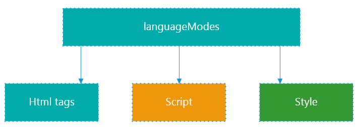
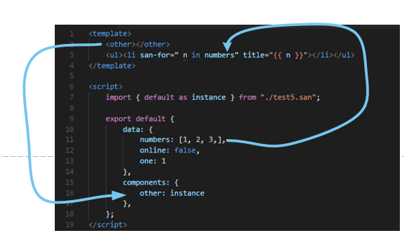
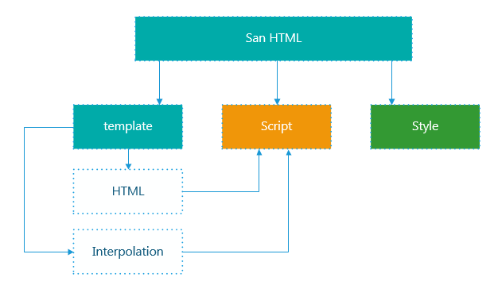
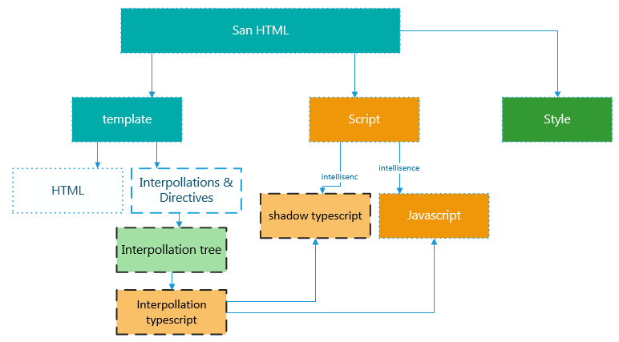

drei是如何工作的
===============

language server 为编辑器client提供语言智能提示功能，包括

* format
* validate
* autoComplete
* goToDefinition
* type Intelligence

等等功能。

vscode官方及社区已有各种语言的language server，为开发者提供了很多便利。

drei是为san设计的language server，（名字是 三 来的）。

一个标准的language server 分为三层

* language server

    对外提供标准化的接口
* language service

    语言服务层面，在解析代码的基础上提供各种智能分析结果
* language service host 

    语言文件系统层，负责文件管理

对于一种复合语言，比如html，其中除了html tag，tag中包含的内容也可能是一种独立的语言(js/ts/css)等，
这时language server分为四层

* language server 
* language modes

    在这一层，会根据请求的不同，调用不同语言的language service，以提供正确的结果

* language services
    
    不同块对应的语言的的language service.

* language service host

对于html这种语言，其各部分语言之间的内容是不相关的，

而对于 .vue, .san 这种单文件组件，template中tag与script中声明的component相关，差值表达式与中script声明的data/methods相关，因此不再是一个简单的树状组织结构。

这个造型

vetur初期的版本基本上是在html的版本上，对script部分作了扩展以支持vue的api自动提示，对html部分增加的tag的自动提示，但对差值表达式没有进行处理。

drei在这个基础上更进一步，让template中的差值表达式和指令都能够获得language service的支持。

为了使用ts language service提供的能力，我们需要准备正确的ts文件，再把请求映射到这些生成的文件上。

由于 interpolation 中的变量是存在作用域的，因此从template的 interpolation 抽出一个 interpolation tree (类似于一个ast)，再从这个树ts的 ast, 也就是一个 typescript 的 source file，。 

ts的ast中所有的节点都包含位置信息，如果生成的ast位置信息不对，在进行后续操作时会抛出各种神秘的异常，这也是开发中的主要障碍。

另外，由于 san 设计的接口并没有考虑到 typescript 的局限性，ts language service 直接对 san文件的script部分进行推断基本就只能拿到一个any的结果，（这里也可能是因为我写的ts定义文件不对），因此在script部分的类型提示是从 js文件生成了一个ts文件，再从ts文件提供类型提示。

生成这两个新文件还有一个前提，需要知道原本script中用户声明的对象的类型，这里就可能产生一个死循环：

你需要在访问一个文件之前知道他的内容，

// 这里需要解释一下为啥会这样

因此这里使用了两个language service

先从其中一个language service中获得基本的类型信息，再生成文件，给到第二个language service提供接口。
